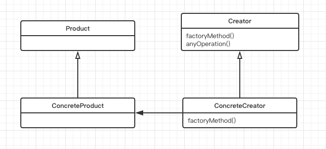
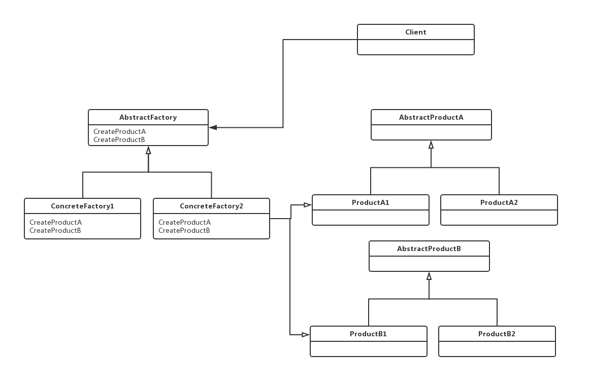

### 设计模式

---

####工厂模式

- 简单工厂

  定义: `把一系列对象的创建过程放到一个统一的地方进行管理`

  ```java
  public class Programmer {
  
      private SimpleBookFactory bookFactory;
  
      public Programmer(SimpleBookFactory bookFactory) {
          this.bookFactory = bookFactory;
      }
  
      /**
       *
       */
      public void liftingTechnology(String bookType){
          /*Book book = null;
          if ("netty".equals(bookType)) {
              book = new NettyBook();
          } else if ("springcloud".equals(bookType)) {
              book = new SpringCloudBook();
          } else if ("algorithm".equals(bookType)) {
              book = new AlgorithmBook();
          }*/
          Book book = bookFactory.createBook(bookType);
          readBook(book);
      }
  
      private void readBook(Book book) {
          System.out.println("Read Book:" + book.getName());
      }
  }
  ```

  

  ```java
  /**
   * @author qun.zheng
   * @description: 创建Book的简单工厂
   * @date 2019/5/7下午11:22
   */
  public class SimpleBookFactory {
  
      public Book createBook(String bookType){
          Book book = null;
          if ("netty".equals(bookType)) {
              book = new NettyBook();
          } else if ("springcloud".equals(bookType)) {
              book = new SpringCloudBook();
          } else if ("algorithm".equals(bookType)) {
              book = new AlgorithmBook();
          }
  
          return book;
      }
  }
  ```


​	:tipping_hand_man:简单工厂不算是设计模式，更像是一种编程习惯。


- 工厂方法

  ```html
  定义了一个创建对象的接口，但由子类决定实例化的是哪一个类。工厂方法把类的实例化推迟到了子类
  ```

    

  示例：

  ```java
  //TODO 待添加
  ```

  

- 抽象工厂

  ```html
  提供了一个接口，用于创建一系列相关或依赖对象的家族，而不需要明确指定具体类
  ```
  
  
  
  示例:
  
  ```java
  //TODO 待添加
  ```
  
  
  
  ---
  
  ### 工厂方法与抽象工厂的区别
  
  - 使用方式不一样：工厂方法是通过子类来获取对象，而抽象工厂是通过组合的方式来获取
  - 对于抽象工厂而言，如果再添加一个新产品，则需要修改所有相关类，而工厂方法因为本身只需要一个产品，则没有这方面的过滤
  
  但是这两种方式都是通过解耦客户与具体的产品进行依赖
  
  ### 使用场景
  
  抽象工厂: 当需要创建产品家族时，可以使用这种方式
  
  工厂方法: 与实例化具体的类进行解耦
  
  #### 开源框架中的使用案例
  
  ```java
  // 待添加
  ```
  
  

